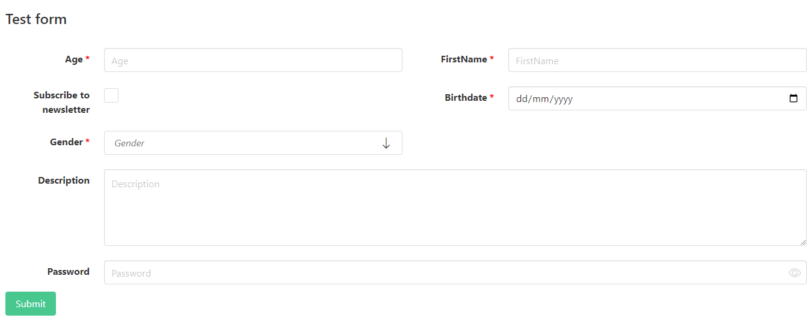

# About
Small library with react form component based on [react components package](https://www.npmjs.com/package/@bodynarf/react.components), which based on Bulma CSS framework&nbsp; <a href="https://bulma.io" title="Bulma css framework">
	
</a>

## Installation
1. Install [React-redux](https://react-redux.js.org/) according to dependencies of current package
2. Install [@bodynarf/react.components](https://www.npmjs.com/package/@bodynarf/react.components) by installation guide there
3. Import `Form` component from `"@bodynarf/react.components.form/component"` and configure as you like

## Description
- **Form** - Form as group of fields with validation for collecting user data via inputs. Uses all simple components above. Built by fields configuration. Uses 12-columns grid from Bulma.

	**Example**:
	<details>
	<summary>Form configuration</summary>
	
	```ts
	{
		name: "group1",
		caption: "Test form",
		items: [
			{
				name: "age",
				type: "number",
				label: {
					caption: "Age"
				},
				viewConfig: {
					layout: {
						column: 0,
						columnSpan: 6,
						row: 0
					}
				},
				required: true,
			},
			{
				name: "firstName",
				type: "text",
				validators: [getLengthValidator(3)],
				label: {
					caption: "FirstName"
				},
				viewConfig: {
					layout: {
						column: 6,
						columnSpan: 6,
						row: 0
					}
				},
				required: true,
			},
			{
				name: "subscribe",
				type: "checkbox",
				label: {
					caption: "Subscribe to newsletter"
				},
				viewConfig: {
					layout: {
						column: 0,
						columnSpan: 6,
						row: 1
					}
				},
			},
			{
				name: "birthday",
				type: "date",
				label: {
					caption: "Birthday"
				},
				required: true,
				viewConfig: {
					layout: {
						column: 6,
						columnSpan: 6,
						row: 1
					}
				}
			},
			{
				name: "gender",
				type: "lookup",
				label: {
					caption: "Gender"
				},
				viewConfig: {
					layout: {
						column: 0,
						columnSpan: 6,
						row: 2
					}
				},
				required: true,
				items: [
					{ id: 'male', value: "male", displayValue: "Male", },
					{ id: 'female', value: "female", displayValue: "Female", },
				]
			},
			{
				name: "description",
				type: "multiline",
				label: {
					caption: "Description"
				},
				viewConfig: {
					layout: {
						column: 0,
						columnSpan: 12,
						row: 3
					}
				},
			},
			{
				name: "password",
				type: "password",
				label: {
					caption: "Password"
				},
				viewConfig: {
					layout: {
						column: 0,
						columnSpan: 12,
						row: 4
					}
				},
			},
		],
		submitButtonConfiguration: {
			type: "success",
			caption: "Submit",
		},
	}
	```
	</details>
	

	*Will be rendered as*

	
